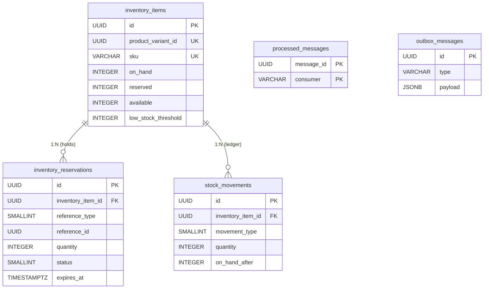

# Database Design Specification: Inventory Management

**Document Version:** 1.0
**Target Architecture:** Relational Database Management System (PostgreSQL)

---

## 1. Overview & Objectives

This document is the database design specification for the **CommerceHub Inventory Service**. The schema supports:

- Stock levels for each sellable variant (SKU): physical stock on hand, stock reserved for pending orders, and the derived available quantity.
- Time-limited **reservations** that hold stock while an order or checkout completes, and are later committed, released or expired.
- An append-only **stock movement ledger** that records every change to `on_hand` so it can be audited.
- Reliable integration with other services over RabbitMQ through an **inbox** (idempotent consumption) and an **outbox** (reliable publishing).

### 1.1. Service Boundaries

- The Inventory Service owns its own database. `product_variant_id` is a **logical reference** to `product_variants(id)` in the Product Catalog service. It is **not** a database foreign key.
- `sku` is copied into this database so that lookups, logs and integration events do not need to call the catalog.

### 1.2. Conventions

- Primary keys are `UUID`, generated with `uuidv7()`.
- Table and column names are snake_case.
- Timestamps are `TIMESTAMPTZ` in UTC.
- Enums are stored as `smallint`, with their values documented in [Section 4](#4-enum-reference).
- Quantities are `INTEGER` in base units.

---

## 2. Entity-Relationship Diagram (ERD)

`processed_messages` and `outbox_messages` are infrastructure tables and have no relationships to the domain tables.

---

## 3. Data Dictionary & Detailed Specifications

### 3.1. Entity: `inventory_items`
Holds one stock record for each product variant. This is the aggregate root.

* **Primary Key:** `id`
* **Unique:** `product_variant_id`, `sku`

| Column Name | Data Type | Constraints | Default | Description |
| :--- | :--- | :--- | :--- | :--- |
| `id` | `UUID` | `PK`, `uuidv7()` | — | Unique inventory item identifier. |
| `product_variant_id` | `UUID` | `UNIQUE`, `NOT NULL` | — | Logical reference to the variant in the Catalog service. |
| `sku` | `VARCHAR(100)` | `UNIQUE`, `NOT NULL` | — | Copy of the variant's SKU. |
| `on_hand` | `INTEGER` | `NOT NULL`, `CHECK (on_hand >= 0)` | `0` | Physical units in stock. |
| `reserved` | `INTEGER` | `NOT NULL`, `CHECK (reserved >= 0)` | `0` | Units held by `Pending` reservations. |
| `available` | `INTEGER` | `GENERATED ALWAYS AS (on_hand - reserved) STORED` | — | Units that can be sold. Read-only. |
| `low_stock_threshold` | `INTEGER` | `NULL`, `CHECK (low_stock_threshold >= 0)` | `NULL` | Publishes a `LowStock` event when `available` drops to or below this value. `NULL` disables the alert. |
| `created_at` | `TIMESTAMPTZ` | `NOT NULL` | `CURRENT_TIMESTAMP` | UTC record creation timestamp. |
| `updated_at` | `TIMESTAMPTZ` | `NOT NULL` | `CURRENT_TIMESTAMP` | UTC last update timestamp. |

**Table constraints**
- `CHECK (reserved <= on_hand)` — stock can never be over-reserved.

**Concurrency:** the PostgreSQL system column `xmin` is mapped as an EF Core concurrency token (`IsRowVersion()` on Npgsql), so it needs no extra column. See [Section 6](#6-concurrency).

---

### 3.2. Entity: `inventory_reservations`
A time-limited hold on stock for one business reference, such as an order.

* **Primary Key:** `id`
* **Foreign Keys:** `inventory_item_id` → `inventory_items(id)` `ON DELETE RESTRICT`

| Column Name | Data Type | Constraints | Default | Description |
| :--- | :--- | :--- | :--- | :--- |
| `id` | `UUID` | `PK`, `uuidv7()` | — | Unique reservation identifier. |
| `inventory_item_id` | `UUID` | `FK`, `NOT NULL` | — | The stock record being held. |
| `reference_type` | `SMALLINT` | `NOT NULL` | — | Owner type. See [4.1](#41-reference_type). |
| `reference_id` | `UUID` | `NOT NULL` | — | Owner identifier, for example an order id. |
| `quantity` | `INTEGER` | `NOT NULL`, `CHECK (quantity > 0)` | — | Units held. |
| `status` | `SMALLINT` | `NOT NULL` | `0` | Lifecycle state. See [4.2](#42-reservation-status). |
| `expires_at` | `TIMESTAMPTZ` | `NOT NULL` | — | Time after which a `Pending` reservation is expired automatically. |
| `created_at` | `TIMESTAMPTZ` | `NOT NULL` | `CURRENT_TIMESTAMP` | UTC record creation timestamp. |
| `updated_at` | `TIMESTAMPTZ` | `NOT NULL` | `CURRENT_TIMESTAMP` | UTC last update timestamp. |

**Indexes**
- `UNIQUE (inventory_item_id, reference_type, reference_id)` — at most one reservation per item per reference, which makes reserve requests idempotent.
- `INDEX (reference_type, reference_id)` — looks up all reservations for an order when it is committed or cancelled.
- `INDEX (expires_at) WHERE status = 0` — partial index used by the expiry sweeper job.

---

### 3.3. Entity: `stock_movements`
An append-only ledger. Every change to `on_hand` writes exactly one row. Rows are never updated or deleted.

* **Primary Key:** `id`
* **Foreign Keys:** `inventory_item_id` → `inventory_items(id)` `ON DELETE RESTRICT`

| Column Name | Data Type | Constraints | Default | Description |
| :--- | :--- | :--- | :--- | :--- |
| `id` | `UUID` | `PK`, `uuidv7()` | — | Unique movement identifier. |
| `inventory_item_id` | `UUID` | `FK`, `NOT NULL` | — | The affected stock record. |
| `movement_type` | `SMALLINT` | `NOT NULL` | — | Kind of movement. See [4.3](#43-movement_type). |
| `quantity` | `INTEGER` | `NOT NULL`, `CHECK (quantity <> 0)` | — | Signed change to `on_hand`: positive for stock in, negative for stock out. |
| `on_hand_after` | `INTEGER` | `NOT NULL`, `CHECK (on_hand_after >= 0)` | — | Snapshot of `on_hand` after this movement, for auditing and reconciliation. |
| `reference_type` | `SMALLINT` | `NULL` | `NULL` | Optional source document type. See [4.1](#41-reference_type). |
| `reference_id` | `UUID` | `NULL` | `NULL` | Optional source document id. |
| `reason` | `VARCHAR(500)` | `NULL` | `NULL` | Free-text note. Required by the application for `Adjustment` and `Damage`. |
| `created_by` | `VARCHAR(100)` | `NULL` | `NULL` | User or system actor that caused the movement. |
| `created_at` | `TIMESTAMPTZ` | `NOT NULL` | `CURRENT_TIMESTAMP` | UTC timestamp of the movement. |

**Indexes**
- `INDEX (inventory_item_id, created_at DESC)` — movement history for an item.
- `INDEX (reference_type, reference_id) WHERE reference_id IS NOT NULL`

**Table constraints**
- `CHECK ((reference_type IS NULL) = (reference_id IS NULL))` — the two reference columns are either both set or both empty.

> Reservations do **not** create movements, because they change `reserved`, not `on_hand`. A movement is written only when stock physically changes, for example when a reservation is committed as a `Sale`.

---

### 3.4. Entity: `processed_messages` (Inbox)
Records the integration messages a consumer has already handled. RabbitMQ delivers at least once, and this table stops a message from being applied twice (for example, decrementing stock twice).

* **Primary Key:** `(message_id, consumer)`

| Column Name | Data Type | Constraints | Default | Description |
| :--- | :--- | :--- | :--- | :--- |
| `message_id` | `UUID` | `PK`, `NOT NULL` | — | Message id from the broker envelope. |
| `consumer` | `VARCHAR(200)` | `PK`, `NOT NULL` | — | Name of the handler that processed the message. |
| `processed_at` | `TIMESTAMPTZ` | `NOT NULL` | `CURRENT_TIMESTAMP` | UTC processing timestamp. |

The insert happens in the **same transaction** as the stock change.

---

### 3.5. Entity: `outbox_messages` (Outbox)
Integration events written in the same transaction as the domain change, then published to RabbitMQ by a background relay.

* **Primary Key:** `id`

| Column Name | Data Type | Constraints | Default | Description |
| :--- | :--- | :--- | :--- | :--- |
| `id` | `UUID` | `PK`, `uuidv7()` | — | Message id, also used as the broker message id. |
| `type` | `VARCHAR(200)` | `NOT NULL` | — | Event type, for example `inventory.stock_reserved`. |
| `payload` | `JSONB` | `NOT NULL` | — | Serialized event body. |
| `occurred_at` | `TIMESTAMPTZ` | `NOT NULL` | `CURRENT_TIMESTAMP` | UTC time the event was raised. |
| `processed_at` | `TIMESTAMPTZ` | `NULL` | `NULL` | UTC time the event was published. `NULL` means pending. |
| `attempts` | `INTEGER` | `NOT NULL` | `0` | Number of publish attempts. |
| `error` | `TEXT` | `NULL` | `NULL` | Last publish error. |

**Indexes**
- `INDEX (occurred_at) WHERE processed_at IS NULL` — used by the relay polling query.

---

## 4. Enum Reference

### 4.1. `reference_type`
| Value | Name | Description |
| :--- | :--- | :--- |
| `0` | `Order` | Customer order. |
| `1` | `Cart` | Checkout session or cart hold. |
| `2` | `PurchaseOrder` | Inbound supplier receipt. |
| `3` | `Return` | Customer return (RMA). |
| `4` | `Manual` | Back-office operation. |

### 4.2. Reservation `status`
| Value | Name | Description | Terminal |
| :--- | :--- | :--- | :--- |
| `0` | `Pending` | Holds stock and counts toward `reserved`. | No |
| `1` | `Committed` | Converted into a sale: stock was deducted from `on_hand`. | Yes |
| `2` | `Released` | Released explicitly, for example when an order is cancelled before payment. | Yes |
| `3` | `Expired` | Released by the sweeper after `expires_at`. | Yes |

Only `Pending` can move to another state, and it can go to any of the terminal states.

### 4.3. `movement_type`
| Value | Name | Sign | Description |
| :--- | :--- | :--- | :--- |
| `0` | `Receipt` | + | Stock received from a supplier. |
| `1` | `Sale` | − | A reservation was committed and the goods shipped or sold. |
| `2` | `Return` | + | Customer return put back into sellable stock. |
| `3` | `AdjustmentIn` | + | Manual correction upward, for example after a cycle count. |
| `4` | `AdjustmentOut` | − | Manual correction downward. |
| `5` | `Damage` | − | Stock written off as damaged or lost. |

The application checks that the sign of `quantity` matches the movement type.

---

## 5. Key Flows

Each flow runs in **one database transaction** that also writes its outbox row(s).

| Flow | `inventory_items` | `inventory_reservations` | `stock_movements` |
| :--- | :--- | :--- | :--- |
| **Reserve** | `reserved += q` (rejected if `available < q`) | insert `Pending` | — |
| **Commit** | `on_hand -= q`, `reserved -= q` | `Pending → Committed` | insert `Sale` (−q) |
| **Release / Expire** | `reserved -= q` | `Pending → Released / Expired` | — |
| **Receipt / Return / Adjust** | `on_hand ± q` | — | insert matching type |

---

## 6. Concurrency

- **Optimistic:** updates to `inventory_items` check `xmin`. If the check fails with `DbUpdateConcurrencyException`, the service reloads the row and retries (bounded, for example 3 times).
- **Atomic alternative for hot SKUs:** run a single conditional statement, for example
  `UPDATE inventory_items SET reserved = reserved + @q WHERE id = @id AND on_hand - reserved >= @q`.
  If it affects 0 rows, the item is out of stock.
- The `CHECK` constraints are the last line of defence, so negative or over-reserved stock cannot be persisted even if the application has a bug.

---

## 7. Out of Scope / Open Questions

1. **Multiple warehouses or locations:** this design keeps one stock row per variant. Supporting several locations would need a `warehouses` table and a unique key on `(warehouse_id, product_variant_id)` in `inventory_items`, plus a `Transfer` movement type.
2. **Backorders and pre-orders:** `available` can never go below 0, so overselling is not allowed.
3. **Inventory valuation:** the design has no unit cost or COGS column.
4. **Batch, lot and expiry-date tracking.**
5. **Creating inventory items:** they could be created automatically from a `ProductVariantCreated` event from the Catalog service, or manually. The consumer of that event would use the inbox table.
6. **Retention:** cleanup policy for `processed_messages` and published `outbox_messages` rows (for example, delete after 7 days).
