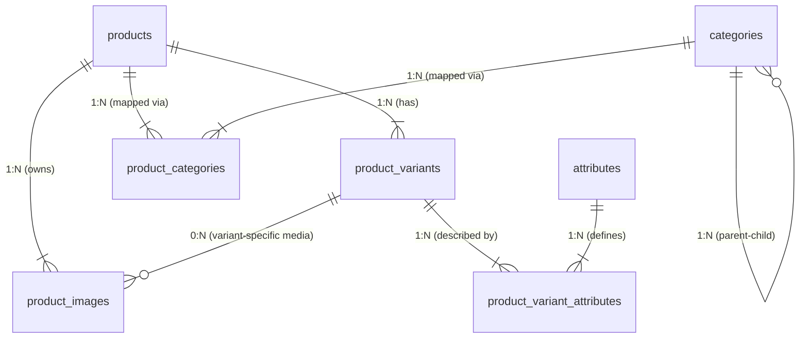

# Database Design Specification: E-Commerce Product Catalog

**Document Version:** 1.0   
**Target Architecture:** Relational Database Management System (RDBMS)  

---

## 1. Overview & Objectives

This document provides the formal database design specification for the **CommerceLab Product Catalog System**. The primary goal of this schema is to support a flexible, scalable product structure that handles:

- Parent products and individual sellable variants (SKUs).
- Dynamic variant attributes (e.g., Size, Color, Capacity) without schema alterations.
- Hierarchical category structures (nested categories).
- Flexible media management attached at either the parent product level or variant level.

---

## 2. Entity-Relationship Diagram (ERD)

The diagram below illustrates the tables, relationships, and cardinalities within the product catalog domain.

---

## 3. Data Dictionary & Detailed Specifications

### 3.1. Entity: `products`
Stores base product definitions that represent the top-level product entity (e.g., "Men's Casual T-Shirt").

* **Primary Key:** `id`
* **Table Description:** High-level product catalog entry containing core descriptive data shared across all variants.

| Column Name | Data Type | Constraints | Default | Description |
| :--- | :--- | :--- | :--- | :--- |
| `id` | `UUID` | `PK`, `uuidv7()` | — | Unique internal surrogate identifier. |
| `name` | `VARCHAR(255)` | `NOT NULL` | — | Commercial name of the product. |
| `slug` | `VARCHAR(255)` | `UNIQUE`, `NOT NULL` | — | Human-readable URL slug for SEO routing. |
| `description` | `TEXT` | `NULL` | `NULL` | Full product description or rich-text content. |
| `status` | `smallint` | `NOT NULL` | `0` | |
| `created_at` | `TIMESTAMP` | `NOT NULL` | `CURRENT_TIMESTAMP` | UTC record creation timestamp. |
| `updated_at` | `TIMESTAMP` | `NOT NULL` | `CURRENT_TIMESTAMP` | UTC last record update timestamp. |

---

### 3.2. Entity: `product_variants`
Stores individual sellable units (SKUs) associated with a parent product (e.g., "Men's Casual T-Shirt - Red / Large").

* **Primary Key:** `id`
* **Foreign Keys:** `product_id` $\rightarrow$ `products(id)`
* **Table Description:** Physical inventory units with unique pricing and stock codes.

| Column Name | Data Type | Constraints | Default | Description |
| :--- | :--- | :--- | :--- | :--- |
| `id` | `UUID` | `PK`, `uuidv7()` | — | Unique internal variant identifier. |
| `product_id` | `UUID` | `FK`, `NOT NULL` | — | Reference to parent product. |
| `sku` | `VARCHAR(100)` | `UNIQUE`, `NOT NULL` | — | Unique Stock Keeping Unit identification code. |
| `name` | `VARCHAR(255)` | `NOT NULL` | — | Variant-specific display name. |
| `price` | `DECIMAL(12, 2)`| `NOT NULL` | `0.00` | Base selling price. |
| `currency` | `VARCHAR(3)` | `NOT NULL` | `'USD'` | ISO 4217 standard 3-letter currency code. |
| `status` | `smallint` | `NOT NULL` | `0` | |
| `created_at` | `TIMESTAMP` | `NOT NULL` | `CURRENT_TIMESTAMP` | UTC record creation timestamp. |
| `updated_at` | `TIMESTAMP` | `NOT NULL` | `CURRENT_TIMESTAMP` | UTC last record update timestamp. |

---

### 3.3. Entity: `attributes` *(Supporting Entity)*
Master definition of attribute keys used across product variants (e.g., "Color", "Size", "Storage Capacity").

* **Primary Key:** `id`

| Column Name | Data Type | Constraints | Default | Description |
| :--- | :--- | :--- | :--- | :--- |
| `id` | `BIGINT` | `PK`, `AUTO_INCREMENT` | — | Unique attribute ID. |
| `name` | `VARCHAR(100)` | `NOT NULL` | — | Display label for attribute (e.g., "Size"). |
| `code` | `VARCHAR(100)` | `UNIQUE`, `NOT NULL` | — | Programmatic key (e.g., `size`, `color`). |

---

### 3.4. Entity: `product_variant_attributes`
Entity mapping attributes and values to variants.

* **Primary Key:** Composite `(variant_id, attribute_id)`
* **Foreign Keys:** 
  * `variant_id` $\rightarrow$ `product_variants(id)`
  * `attribute_id` $\rightarrow$ `attributes(id)`
* **Table Description:** Key-value structure holding specific variant characteristics.

| Column Name | Data Type | Constraints | Default | Description |
| :--- | :--- | :--- | :--- | :--- |
| `variant_id` | `UUID` | `FK`, `NOT NULL` | — | Reference to associated variant. |
| `attribute_id` | `BIGINT` | `FK`, `NOT NULL` | — | Reference to master attribute key. |
| `value` | `VARCHAR(255)` | `NOT NULL` | — | Specific value assigned (e.g., "Red", "XL", "256GB"). |

---

### 3.5. Entity: `categories`
Stores product categories in an Adjacency List model to support hierarchical categorization.

* **Primary Key:** `id`
* **Foreign Keys:** `parent_id` $\rightarrow$ `categories(id)`
* **Table Description:** Category taxonomy tree structure.

| Column Name | Data Type | Constraints | Default | Description |
| :--- | :--- | :--- | :--- | :--- |
| `id` | `BIGINT` | `PK`, `AUTO_INCREMENT` | — | Unique category identifier. |
| `parent_id` | `BIGINT` | `FK`, `NULL` | `NULL` | Self-referencing ID for parent category. `NULL` denotes root category. |
| `name` | `VARCHAR(255)` | `NOT NULL` | — | Display category name. |
| `slug` | `VARCHAR(255)` | `UNIQUE`, `NOT NULL` | — | URL-friendly unique identifier. |
| `status` | `smallint` | `NOT NULL` | `0` | |

---

### 3.6. Entity: `product_categories`
Junction table mapping products to categories in a Many-to-Many ($N:M$) relationship.

* **Primary Key:** Composite `(product_id, category_id)`
* **Foreign Keys:**
  * `product_id` $\rightarrow$ `products(id)`
  * `category_id` $\rightarrow$ `categories(id)`

| Column Name | Data Type | Constraints | Default | Description |
| :--- | :--- | :--- | :--- | :--- |
| `product_id` | `UUID` | `FK`, `NOT NULL` | — | Reference to product entity. |
| `category_id` | `BIGINT` | `FK`, `NOT NULL` | — | Reference to category entity. |

---

### 3.7. Entity: `product_images`
Manages media asset links assigned to products or specific variants.

* **Primary Key:** `id`
* **Foreign Keys:**
  * `product_id` $\rightarrow$ `products(id)`
  * `variant_id` $\rightarrow$ `product_variants(id)` (Optional)

| Column Name | Data Type | Constraints | Default | Description |
| :--- | :--- | :--- | :--- | :--- |
| `id` | `BIGINT` | `PK`, `AUTO_INCREMENT` | — | Unique image identifier. |
| `product_id` | `UUID` | `FK`, `NOT NULL` | — | Associated base product. |
| `variant_id` | `UUID` | `FK`, `NULL` | `NULL` | Associated specific variant (if `NULL`, image applies generally to product). |
| `url` | `VARCHAR(2048)`| `NOT NULL` | — | Fully qualified URL or path to media file (S3/CDN). |
| `sort_order` | `INT` | `NOT NULL` | `0` | Display sequence order for gallery UI. |

---

## 4. Relationship Integrity Constraints & Business Rules

1. **Product to Variant Cascade:**  
   - Delete/Update behavior: When a parent record in `products` is deleted, associated entries in `product_variants`, `product_categories`, and `product_images` should trigger `ON DELETE CASCADE`.
2. **Nullable Foreign Keys for Contextual Media:**  
   - `product_images.variant_id` is set to `NULLABLE`. If `variant_id` is present, the image belongs specifically to that variant (e.g., Red T-Shirt view). If `variant_id` is `NULL`, it serves as a general product image.
3. **Hierarchy Integrity:**  
   - `categories.parent_id` must maintain referential integrity with `ON DELETE SET NULL` or restrictive handling to prevent orphaned subtrees.
4. **Composite Uniqueness:**  
   - Primary Keys for junction tables (`product_categories`, `product_variant_attributes`) enforce uniqueness, ensuring no duplicate classification or duplicate attribute keys per variant.

---